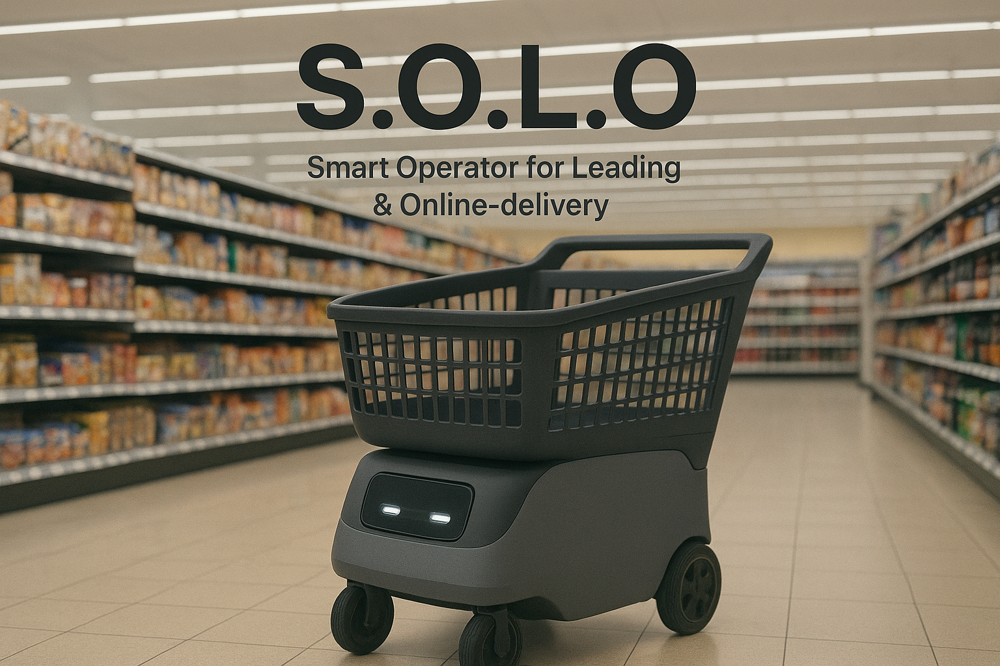
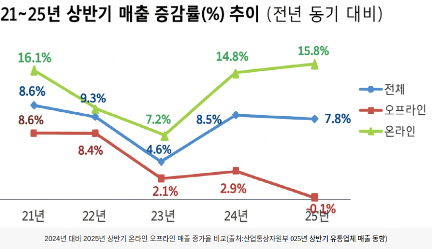
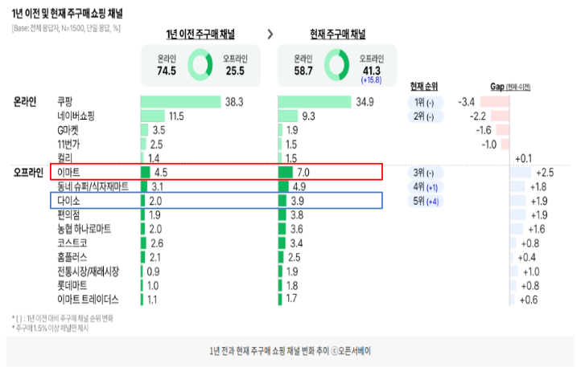

# 차세대 스마트 리테일을 위한 AMR 쇼핑카트  (Team S.O.L.O)

    

> Smart Operator for Leading & Online-delivery  
> K-Digital Training Final Project (2025.10.21 ~ 2025.11.28)

--- 
 
 

# 목차
- [1. 프로젝트 개요](#1-프로젝트-개요)
  - [1.1. 팀 정보](#11-팀-정보)
  - [1.2. 사용 기술](#12-사용-기술)
- [2. 배경 및 문제 정의](#2-배경-및-문제-정의)
- [3. 프로젝트 목표 및 주요 기능](#3-프로젝트-목표-및-주요-기능)
- [4. 시스템 설계](#4-시스템-설계)
  - [4.1. 시스템 요구사항 및 모드 구성](#41-시스템-요구사항-및-모드-구성)
  - [4.2. 사스템 아키텍처](#42-시스템-아키텍처)
  - [4.3. 데이터베이스 설계](#43-데이터베이스-설계)
  - [4.4. 사용자 인터페이스 설계](#44-사용자-인터페이스)
  - [4.5. 프로젝트 시나리오](#45-프로젝트-시나리오)
- [5. 구현 기술](#5-구현-기술)
  - [5.1. ](#51-다중-로봇-관제-및-제어)
  - [5.2.](#52-aicomputer-vision-기술)
  - [5.3.](#53-주행-기술)
  - [5.4.](#54-aruco-marker-기반-정밀-주차)
- [6. 협업 및 프로젝트 관리](#6-협업-및-프로젝트-관리)
- [7. ](#7-demo)
- [8. ](#8-appendix--모델-비교-정리)

--- 
 
 

# 1. 프로젝트 개요

본 프로젝트는 **차세대 스마트 소매 환경(마트, 상점, 온·오프라인 연계 매장)** 을 위한  
**AMR(Autonomous Mobile Robot) 기반 자율주행 쇼핑카트** 시스템을 구현하는 것을 목표로 합니다.

- 온라인 주문 기반 **자동 집품 & 배송 준비**
- 오프라인 고객을 위한 **가이드 / 팔로잉 쇼핑 지원**
- 관리자 관제 환경에서의 **다중 카트 제어 및 상태 모니터링**
- **Deep Learning·Computer Vision·ROS2 기반 자율주행 기술** 통합

 
 

## 1.1. 팀 정보

- **Team S.O.L.O** (Smart Operator for Leading & Online-delivery)

|이름|역할|E-mail|담당 업무|
|:---|:---|:---|:---|
|**이수**|팀장|isugkgkgk@gmail.com |프로젝트 기획 및 관리  시스템 설계 및 문서 관리  마트 중앙 관제SW 개발  쇼핑 카트 중앙 제어SW 개발  시스템 기능 통합 및 테스트|
|**박장호**|팀원|pjh62698967@gmail.com| 시스템 DB 구현 Demo Map 설계  SITL 시뮬레이션 환경 구현  오프라인 사용자 GUI 개발 관리자 GUI 개발|
|**이건명**|팀원|gmlee729@gmail.com| 시스템 DB 설계 카메라 송출 UDP 서버 개발 사용자 인식 상품 인식 AI 모델 개발  ArUco Marker 기반 정밀 주차 기능 구현| 
|**이건창**|팀원|nemogun21@gmail.com| GUI 설계 온라인 사용자 GUI 개발 관리자 GUI 개발|
|**최승혁**|팀원|rrnrrn2030@gmail.com| 쇼핑 카트 장애물 회피 기능 구현 쇼핑 카트 자율주행 기능 구현|

 
 

## 1.2. 사용 기술

| 분류 | 사용 기술 |
| :--- | :--- |
| **AI / Deep Learning** |     |
| **Development** |   |
| **Robot Operation** |   |
| **GUI & Database** |   
| **Collaboration** |     |

---

 
 

# 2. 배경 및 문제 정의

최근 리테일 환경에서는 다음과 같은 변화와 한계가 동시에 나타난다.

 
 

## 2.1 오프라인 매장 수요 증가

    

    

- 2021~2025년 매출 증감률: **오프라인(하향 추세) < 온라인(상승 추세)**
- 2024-2025년 오프라인 이용 비중 변화: **2024(25.5%) -> 2025(41.3%) (15.8% 상승)** 

→ **오프라인 매장의 이용률 증가**과 함께, 효율적인 운영 및 고객 경험 개선이 중요한 과제가 됨.

 
 

## 2.2. 문제점

- **비효율적인 고객 동선**
- **매장 운영 노동력의 한계**
- **온라인 기반 퀵커머스 시대에 맞지 않는 기존 시스템**
- **안전·쇼핑 피로도·인건비·노동력 부담 증가**

---

 
 

# 3. 프로젝트 목표 및 주요 기능

## 3.1. 프로젝트 목표

- **고객 중심**의 스마트 쇼핑 경험 제공
- **매장 중심**의 효율적인 재고·동선·운영 관리
- **노동력·인건비 절감** 및 자동화 수준 향상
- 온·오프라인을 연결하는 **하이브리드 리테일 플랫폼** 구현

 
 

## 3.2. 주요 기능

1. **온라인 쇼핑 및 주문**
2. **자율주행(가이드 & 팔로잉)**
3. **장애물 회피 및 안전 주행**
4. **자동 집품 및 배송 준비**
5. **쇼핑 종료 후 카트 자동 복귀**

---

 
 

# 4. 시스템 설계
## 4.1. 시스템 요구사항 및 모드 구성

프로젝트 전체 시스템은 **3개의 주요 모드**로 구성된다.

 
 

### 4.1.1. 온라인 모드 (OnGui)

- 회원 로그인 상태 관리
- 장바구니 주문서 작성
- 자동 장보기 서비스
- 실시간 주문 현황 확인
- 쇼핑 종료 및 카트 복귀 기능

 
 

### 4.1.2. 오프라인 모드 (InterfaceM)

- 등록된 사용자 정보 관리
- 구매 희망 품목 설정
- 쇼핑 지원 기능 (가이드, 팔로잉)
- 카트 수동 조작 변환
- 쇼핑 종료 및 카트 복귀 기능

 
 

### 4.1.3. 관리자 모드 (AdminGui)

- 상품 목록 관리
- 실시간 카트 관제
- 자동 작업 할당
- 다중 카트 제어 관리
- 카트 기타 상태 모니터링

---

 
 

## 4.2. 시스템 아키텍처

### 4.2.1. HW 아키텍처
<!-- TODO: HW 전체 블록 다이어그램 이미지 

    

 -->

주요 구성 요소:

- **Customer PC**: 온라인 고객 GUI (OnGui)
- **Admin PC**: 관리자 GUI (AdminGui)
- **Cart Controller**: 카트 중심 중앙 제어
- **Market Server**: 매장 관리 서버
- **센서 및 액추에이터**
  - LiDAR
  - IMU
  - Camera (전/후방)
  - Motor Driver
  - LED Lamp
- **AI Operator**
  - Computer Vision 연산 노드
- **Cart Interface**
  - RFID Reader
  - Speaker
  - Microphone
  - Keyboard
  - LCD

---

 
 

### 4.2.2. SW 아키텍처

#### 주요 소프트웨어 모듈
<!-- TODO: 전체 SW 모듈 간 통신/화살표 구조도 (토픽/메시지 흐름)

    

 -->

1. **OnGui**
    - 온라인 고객용 인터페이스
    - 사용자 로그인 정보 관리
    - 주문서 작성
    - 물품 재고 현황 조회

2. **MarketCoreManager**
    - 사용자 주문 관리
    - 매장 물품 정보 관리
    - 매장 내 카트 중앙 관리 및 업무 할당

2. **InterfaceManager (InterfaceM)**
    - 오프라인 고객용 인터페이스
    - 음성 정보 / 주문 정보 / RFID 정보 입력
    - PerceptionManager & CartStateManager와 상호작용

3. **AdminGui**
    - 관리자용 인터페이스
    - 주문 상태, 카트 상태, 물품 정보, 고객 정보 조회

4. **CartStateManager**
    - 주행 임무 수신
    - 카트 상태 및 주문 상태 전송

5. **SensorManager**
    - 장애물 인식
    - 자세 정보 수집

6. **ActuatorController**
    - 속도 제어
    - LED 신호 제어

7. **CameraManager & PerceptionManager**
    - 영상 정보 수집 및 처리
    - 고객 추적, 손동작 인식, ArUco 마커 인식
    - 음성 변환 정보 및 카트 상태 정보 처리

---

 
 

## 4.3. 데이터베이스 설계

DB는 **카트 상태, 주문, 사용자 정보, 물품 정보**를 중심으로 구성했다.

 
 

### 주요 테이블

<!-- TODO: DB ERD 또는 DBML 구조도 스냅샷

    

 -->

- `robot`  
  - 카트 식별 정보

- `robot_status`  
  - 카트 상태 정보

- `error_status`  
  - 카트 동작 오류 정보

- `connection_state`  
  - 카트 연결 상태

- `order_status`  
  - 주문 상태 관리

- `user_info`  
  - 고객 정보 관리

- `task_status`  
  - 임무(집품/배송 등) 상태 관리

- `location`  
  - 물품 위치 정보 (매장 내 좌표/구역)

- `item_status`  
  - 물품 상태 관리

→ 이를 조합하여:
- **카트 정보**
- **주문 정보**
- **물품 정보**

를 통합적으로 관리한다.

---

 
 

## 4.4. 사용자 인터페이스

### 4.4.1. InterfaceManager (오프라인 고객용)
<!-- 

    

 -->
- 매장 내부에서 서비스 이용하는 고객용 인터페이스
- 기능:
  - 매장 내 물품 표시
  - 카트 수동 전환
  - 주문 리스트 작성
  - 음성 인식 지원

 
 

### 4.4.2. OnGui (온라인 고객용)
<!-- 

    

 -->
- 매장 외부에서 서비스 이용
- 기능:
  - 온라인 로그인 관리
  - 주문 리스트 작성
  - 재고 확인

 
 

### 4.4.3. AdminGui (관리자용)
<!-- 

    

 -->
- 매장 관리 및 감독용
- 기능:
  - 매장 내 물품 관리
  - 카트 실시간 위치 파악
  - 카트 상태 관리
  - 주문 및 배송 관리

<!-- TODO: 각 GUI 화면 스크린샷 (OnGui / InterfaceM / AdminGui) -->

---

 
 

## 4.5. 프로젝트 시나리오

### 4.5.1. 온라인 모드
<!-- 

    

 -->
1. **온라인 상품 검색**
2. **온라인 주문**
   - 상품 선택
   - 배송지 또는 포장 설정
3. **자동 집품 시스템**
   - 쇼핑카트가 주문한 상품을 자동 집품
4. **포장 / 배송**
   - 포장 구역 도착
   - 택배사 또는 픽업
5. **카트 복귀**
   - 충전/대기 장소로 자동 이동

> 이 과정에서 카트의 **LED 색상**으로 상태를 표현하고,  
> AdminGui에서 실시간으로 맵과 상태 변화를 확인할 수 있다.

 
 

### 4.5.2. 오프라인 모드 (가이드 & 팔로잉)
<!-- 

    

 -->
1. 사용자 등록 (신체 정보 등록)
2. 쇼핑 모드 선택: **가이드 / 팔로잉 (상시 변경 가능)**
3. 목적지 입력 후:
   - 가이드 모드: 지정 위치까지 선행하며 안내
   - 팔로잉 모드: 사용자를 추종하면서 이동
4. 쇼핑 종료 후 카트 복귀

> 등록된 사용자를 추적하면서 **거리 조절 및 추종**을 수행하는 모습을 구현하였다.

<!-- TODO: 팔로잉 데모 영상 캡처 / LED 색상 변화 & AdminGui 맵 연동 스샷 -->

---

 
 

# 5. 구현 기술

## 5.1. 다중 로봇 관제 및 제어

### 5.1.1. 중앙 관제 로직

**Rule-based 중앙 관제**를 통해 다중 카트를 효율적으로 관리한다.

 
 

#### 업무 할당 조건

1. 카트 배터리 잔량이 **40% 이상**인 카트만 작업 가능
2. 가장 오래 대기 중인 카트를 우선 할당

 
 

#### 구역 집중화 방지 로직

1. 동일 물품 집품 시, **먼저 작업 중인 카트** 우선 집품
2. 작업 완료 시, **먼저 완료된 카트** 우선 복귀

→ 카트의 작업 스케줄이 **편향되지 않도록** 중앙에서 조정

---

 
 

### 5.1.2. State Machine 기반 로봇 동작

카트 동작은 **State Machine** 기반으로 설계되었다.

- 대표 상태 흐름:
  - `대기 → 이동 → 작업 → 복귀 → 대기`
- 특징:
  - 상태 조건이 명확하여 **돌발 행동 최소화**
  - 유지보수성 및 디버깅 용이

<!-- TODO: State Machine 다이어그램 (대기/이동/작업/복귀) -->

---

 
 

## 5.2. AI·Computer Vision 기술

### 5.2.1. AI in Mart – 요구사항
<!-- 

    

 -->
스마트 리테일 환경의 AI는 다음 요구사항을 만족해야 한다.

- **Robustness**
  - 다양한 상황·혼잡 환경에서 안정적인 행동
  - 의도하지 않은 행동 방지
- **Real-time Processing**
  - 실시간 변화 대응
  - 사용자 편의를 위한 즉각 반응
- **Edge Efficiency**
  - 제한된 카트 하드웨어 자원
  - 모바일/엣지 환경에서의 성능 최적화

---

 
 

### 5.2.2. 식품 신선도 측정 (YOLO + RexNet)
<!-- 

    

 -->
구성:

- **YOLO**: 상품 인식 (Banana, Meat 등 물품 클래스)
- **RexNet**: 신선도 측정 (Fresh / Spoiled 분류)
- **Best 결정 로직**:
  - 동일한 신선식품 중, Fresh conf가 가장 높은 상품을 Best로 선정
  - 최종 출력: `Best / Fresh / Spoiled`

 
 

#### 데이터셋

- Banana, Meat 각각 **Fresh / Spoiled 1,000장** 학습

 
 

#### RexNet 특징

- 빛 질감, 미세 패턴 검출에 강한 CNN 기반
- RexNet-150: 약 5M Parameters
- 병목 현상 완화, SlLU 활성화 함수 사용 → 정보 손실 최소화

<!-- TODO: YOLO 박스 + RexNet 출력 예시 스크린샷 -->

---

 
 

### 5.2.3 사용자 ReID + Tracking
<!-- 

    

 -->
구성:

1. **YOLO**: 사람 탐지
2. **Register 단계**
   - HSV / Size / Location 기반 특징 추출
3. **Compare 단계**
   - 이후 프레임에서 유사도 비교
4. **Tracking 단계**
   - 동일 사용자 ID 유지 및 추적

 
 

#### 기술적 세부사항

- **HSV Histogram**
  - 대상자 색상 분포 저장 (EMA 기반)
- **Box 크기 가중치**
  - 작을수록 멀리 있는 것으로 판단
- **Location 가중치**
  - 이전 프레임 위치와 비교하여 유사도 계산
- 위 요소를 조합하여 **가장 유사도가 높은 box-ID 매칭**

> 다양한 자세, 옆/뒷모습, 가림/사라짐 상황에서도 **강건한 ID 유지** 가능하도록 설계

---

 
 

### 5.2.4. 손동작 인식 (MediaPipe Hands)
<!-- 

    

 -->
등록된 사람을 대상으로 **손동작 기반 카트 제어** 기능을 구현하였다.

- **MediaPipe Hand Landmark** 기반 손 관절 좌표 추출
- 트리거 동작 이후 손동작 해석 → 명령 전달

 
 

#### 문제 상황 & 해결 방안

- 단순히 서 있을 때, 원치 않는 손동작이 인식되는 문제
  - → **신체 상단 40% 범위에서만 인식**
- 손을 위로 들어 올릴 때, 의도치 않은 동작 인식
  - → **트리거 동작(Shaka 포즈)** 를 설정
- 손날(옆면) 인식 문제
  - → 손가락 사이 최소 비율 기준 설정

 
 

#### 제어 명령

- 오른손 Hand Landmark 기반 제스처 인식:
  - **정지**
  - **팔로잉 시작/유지**
  - **호출(Shaka)**

<!-- TODO: Hand Landmark 시각화, 제스처별 예시 이미지 -->

---

 
 

## 5.3. 주행 기술

### 5.3.1. Waypoint 기반 주행

#### 선정 이유

- **예측 가능한 동선 확보**
  - 혼잡한 마트 환경에서 **안전 사고 예방**
  - 항상 같은 통로/지점에서 회전 → 사람이 예측 가능한 규칙적인 주행
- 매장 내 주요 지점을 **Waypoint**로 설정

 
 

#### Waypoint Graph

- 맵을 Waypoint Graph로 축약
- **BFS 기반 최단 경로 탐색**
- 계산량 최적화 및 디버깅에 유리

 
 

#### 초기 문제

- 길은 있지만 주행 중 멈추거나 제자리에서 맴돎
- 교착 상태 감지/대응 로직 부재

 
 

#### 개선: 교착 상태 감지 & 회피

- 남은 거리 기반 교착 검출:
  - 목표까지의 남은 거리를 주기적으로 체크
  - **5초 동안 5cm 이하로 줄어들지 않으면 교착 상태로 판정**
- 대응 로직:
  - 교착 시 상태 초기화
  - 현재 위치 기준 가장 가까운 출발점 재탐색
  - 이전 경로를 제외한 **우회 경로 탐색**

 
 

#### 최종 결과

- 로봇이 스스로 움직이지 않는 상황을 감지하고 재시도
- 좁은 통로나 장애물 상황에서도 우회 가능
- 전체 주행 성공률 및 **연속성 크게 향상**

---

 
 

### 5.3.2 Path Planning (Nav2 – SmacPlanner2D & RPP)

#### 선정 이유

- **부드러운 곡선 경로 생성**
  - 카트 회전 반경을 고려한 곡선 경로
- **안전한 거리 유지**
  - 좁은 통로에서도 벽과의 여유거리 확보
- **상황별 자동 감속**
  - 장애물·급커브 구간에서 선속도를 줄여 사람 친화적 주행

 
 

#### 초기 문제

- 벽/진열대와 충돌 or 과도한 근접
- 코너에서 속도가 빨라 흔들림
- 경로 이탈 발생

 
 

#### 개선 과정

1. **플래너 교체**
   - `Navfn (Dijkstra)` → `SmacPlanner2D (A*)`
2. **모션 모델 교체**
   - REEDS_SHEPP 기반 회전 반경 반영
   - 장애물과 거리를 두는 중앙선 쪽 경로를 선호하도록 설정
3. **컨트롤러 교체**
   - `DWB` → `Regulated Pure Pursuit (RPP)`
   - 코너 및 장애물 근처에서 자동 감속

 
 

#### 최종 결과

- 벽 및 진열대와의 충돌/근접 주행 감소
- 코너 진입 시 자동 감속
- **부드러운 곡선 주행 구현**

---

 
 

## 5.4. ArUco Marker 기반 정밀 주차

### 선정 이유

- Navigation만으로는 **충전용 Docking과 같은 정밀 제어**가 어려움
- 충전을 위해:
  - 마커와 완전히 수직·중앙 정렬
  - 지정된 위치에 정확히 정차해야 함

 
 

### 주차 프로세스 단계

1. **곡선 주행**
   - 수직선상 위치에 도달하기 위해 곡선 이동
2. **직선 주행**
   - 마커를 향해 직선으로 접근
3. **최종 정렬**
   - 마커와의 위치 및 각도 미세 조정
4. **회전**
   - 정확한 위치에 정렬 후 180도 회전

 
 

### 초기 문제

- 마커 인근까지는 이동하지만 수직선 도달 실패
- x(좌우 오차) 감소 거리 부족
- 마커와의 거리 변화로 인한 **일시적 인식 끊김**

 
 

### 개선 접근

- 직선/곡선/직각 주행 등 다양한 방식 실험
- x 오차 빠른 감소를 위해:
  - 이상 상황 시 마커를 화면 옆에 위치시켜 **강제 곡선 주행**
- 마커를 놓쳐도:
  - **0.2초 동안 기존값 유지**하여 안정성 확보

 
 

### 최종 결과

- 원하는 주차칸에 정확히 정지
- 짧은 거리에서도 요구 수준의 정밀도 달성
- 일시적인 마커 인식 끊김에도 안정적인 주행 유지

<!-- TODO: ArUco 인식 화면, 주차 전/후 비교 이미지 -->

---

 
 

# 6. 협업 및 프로젝트 관리

## 6.1. Confluence

- 기술 문서 작성
- 시스템 구조 정리
- 회의 기록 및 의사결정 내역 정리

 
 

## 6.2. Jira (Scrum Board)

- 스프린트 기반 업무 관리
- 태스크별 진행상황 추적

 
 

## 6.3. GitHub

- 이슈 기반 협업
- 변경 이력 투명성 확보
- Repository 구조 설계 및 버전 관리

<!-- TODO: Confluence 페이지, Jira 보드, GitHub repo 구조 캡처 -->

---

 
 

# 7. Demo

<!-- TODO: 실제 데모 영상(YouTube/Drive) 링크 삽입 -->

- 온라인 자동 집품 데모
- 오프라인 팔로잉 데모
- Waypoint 기반 자율주행 데모
- ArUco 정밀 주차 데모

---

 
 

# 8. Appendix – 모델 비교 정리

## 8.1. 신선도 측정 모델 비교

| 항목 | Only YOLO | YOLO + RexNet | Only RexNet |
|------|-----------|----------------|-------------|
| 객체 탐지 | A | A | 불가 |
| 신선도 분류 | C (질감 유지 미흡) | A | B (초근거리 한정) |
| 하드웨어 성능 요구 | B | C | A (CNN 단독) |
| 데이터셋 요구량 | C (라벨링 많음) | A (YOLO 추가학습X, RexNet만) | A (온라인 이미지 활용) |

 
 

## 8.2. ReID 알고리즘 비교

| 항목 | HSV 분석 | DeepSORT | ByteTrack |
|------|----------|----------|-----------|
| ID 방식 | HSV | ReID 임베딩 + 칼만필터 | 위치 유사도 (Appearance 미사용) |
| 가림/사라짐 대응 | A | A | C |
| 조명 변화 대응 | C | A | A |
| 하드웨어 성능 요구 | A | C | B |

---

 
 

# 8.3. Q&A

프로젝트 및 코드, ROS2 환경, Navigation 설정, AI 파이프라인에 대해  
자세한 문의는 Issue 또는 이메일로 연락해 주세요.